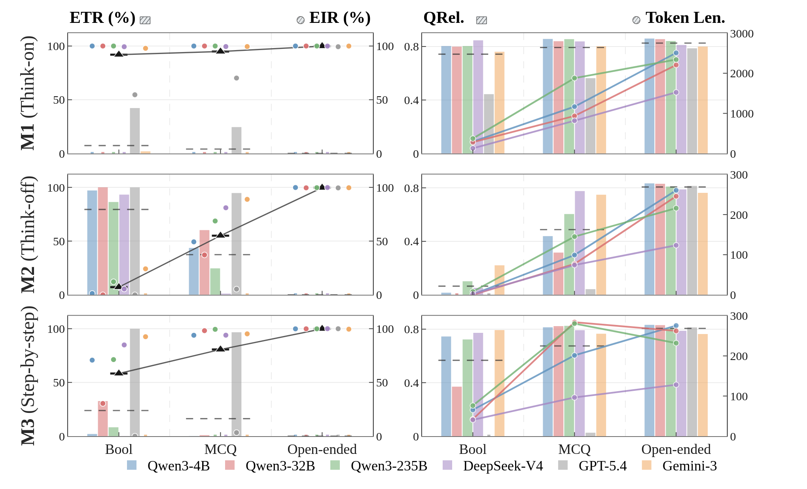

<div align="center">

<h1>Thinking Inertia: LLMs Keep Thinking When Told Not To</h1>

<p><strong>Dianqiao Lei<sup>1</sup> · Kevin Qinghong Lin<sup>2</sup><sup>†</sup><sup>✉</sup> · Pan Lu<sup>3</sup> · Philip Torr<sup>2</sup><sup>✉</sup> · James Zou<sup>3</sup><sup>✉</sup></strong></p>

<sup>1</sup> Tsinghua University · <sup>2</sup> University of Oxford · <sup>3</sup> Stanford University

<sup>†</sup> Project lead · <sup>✉</sup> Correspondence

<p>
  <a href="https://thinking-inertia.github.io/"></a>
  <a href="https://arxiv.org/abs/2610.11765"></a>
  <a href="LICENSE"></a>
  <a href="https://huggingface.co/datasets/thinking-inertia/llm-nothinking-trajectories"></a>
</p>

<em>Response-level evidence for when language models keep thinking after being told not to.</em>

</div>

## 📣 News

- **2026.10** — Public release of the evaluation and metric-validation code.
- **2026.09** — Our paper is accepted as a Poster at NeurIPS 2026!

## 🔎 Overview

We study whether a model that is instructed to answer directly still emits
visible pre-answer text. Each response is represented as a pre-answer field
`T` followed by a final answer `A`. The public evaluator supports six
intervention modes, multiple answer spaces, and benchmark-level accuracy and
format analysis.

The paper uses three complementary response-level measures:

- **ETR** — strict answer-only compliance, based on an empty `T`;
- **QRel.** — instruction-aware relevance between the question and `T`;
- **EIR** — visible explicit inference identified by a blinded language-model
  judge.

The central pattern is an answer-space staircase: visible inference generally
increases from Boolean to multiple-choice to open-ended answers, while stricter
no-thinking interventions reduce it within each answer space. These measures
are response-level observables; they do not claim to reveal latent cognition.

<p align="center">
  
</p>

## 📌 Key findings

- **Answer-space staircase.** The visible-inference ordering is `Bool < MCQ <
  Open`, with open-ended answers retaining the most explicit pre-answer work.
- **Thinking inertia.** Within each answer space, stricter no-thinking controls
  reduce visible inference (`M5 < M2`) but do not erase the answer-space effect.

Here, **M2** is native think-off (disabled thinking without an added output constraint), while **M5** is the strict answer-only prompt.

## ⚙️ Installation

```bash
git clone https://github.com/thinking-inertia/code.git
cd code
python -m venv .venv
source .venv/bin/activate
python -m pip install -U pip
python -m pip install -e .
```

The evaluator needs Python 3.10 or newer. Model serving is external and can be
any OpenAI-compatible endpoint; no provider credential is stored here.

## 🚀 Quick start

Download the normalized benchmark inputs:

```bash
python -m thinking_inertia.download_datasets \
  --root-dir data \
  --overwrite
```

Run a small six-mode local evaluation:

```bash
python -m thinking_inertia.eval_thinking_spectrum \
  --root-dir data \
  --datasets boolq strategyqa mmlu mmlu_pro gsm8k math \
  --base-url http://127.0.0.1:8401/v1 \
  --model qwen3-4b \
  --api chat \
  --modes 1 2 3 4 5 6 \
  --max-samples 200 \
  --sample-strategy level_balanced \
  --seed 20260502 \
  --run-name qwen3_4b_spectrum_demo
```

The run writes local records and summaries to the requested run directory.
For a minimal parser/accuracy check, use:

```bash
python -m thinking_inertia.eval_nonreason --help
```

## 🗂️ Repository layout

```text
src/thinking_inertia/   Dataset loading, response parsing, scoring, runners, and metrics
data/processed/         Normalized public benchmark inputs
outputs/                Local generated records and aggregates (ignored)
pyproject.toml          Package metadata and command-line entry points
requirements.txt        Runtime dependencies
```

## 🧪 Data and models

The files under `data/processed/` are normalized inputs derived from public
benchmarks. Users must follow each upstream dataset's license and terms. The
model endpoint, model weights, tokenizer, and API credentials are supplied by
the user at runtime and are not distributed by this repository.

## 📚 Citation

```bibtex
@article{lei2026thinkinginertia,
  title   = {Thinking Inertia: LLMs Keep Thinking When Told Not To},
  author  = {Lei, Dianqiao and Lin, Kevin Qinghong and Lu, Pan and Torr, Philip and Zou, James},
  year    = {2026},
  eprint  = {2610.11765},
  archivePrefix = {arXiv},
  url     = {https://arxiv.org/abs/2610.11765}
}
```
